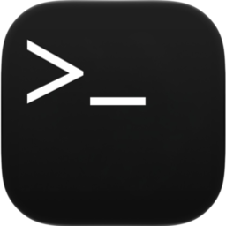
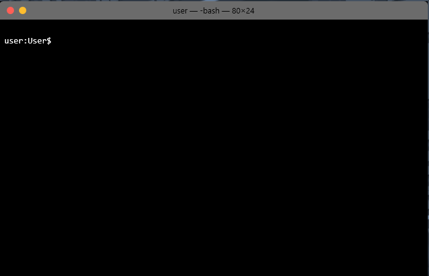

  

<h1 align="center">macOS Terminal for Windows</h1>

  A clean, lightweight terminal emulator that brings the exact minimalist look and feel of Apple's macOS Terminal straight to Windows. 

  Completely free, standalone, and closed-source—no bloatware, no ads, and no tracking. Just launch it and go.

---

## 📸 Preview

  

---

## ✨ Features

* **True macOS Look:** Features the exact dark workspace frame, rounded glass window geometry, and classic solid grey window top title bar style.
* **Persistent Engine Environment:** Powered directly by a continuous live background session. Directory navigation (`cd`), environment variables, and execution paths hold their state flawlessly across subsequent command items.
* **Ultra-Fast Asynchronous Pipeline:** Core engine commands execute on independent background processing channels. The interface thread stays completely fluid without dropping screen render frames or freezing up on unexpected task loads.
* **Built-in Offline Code Reference:** Quick dictionary lookup dashboard integration. Type `csref` to pull up language documentation structures and code syntax tokens right on the screen without an internet connection.
* **Smart Command Memory:** Includes standard up-to-top terminal shell command history loops. Tap the `Up` and `Down` arrow keys to cycle through previous input entry logs seamlessly.
* **Zero Welcome Footprint:** Run the standalone tool instantly. No system greeting noise, registry clutter, background service bloat, or slow profile loading hooks.

---

## 💻 System Requirements

* **Operating System:** Windows 10 or Windows 11 (64-bit)
* **Prerequisites:** .NET Framework v4.0 / v4.8 runtime environment dependencies
* **Storage:** Less than 10 MB

---

## 🚀 Download & Usage

1. Head over to the [Official V1.0.0 Release Page](https://github.com/Amcos-Windows/MacOS-Terminal-For-Windows/releases/tag/V1.0.0).
2. Download **`MacTerminal.exe`** from the Assets section.
3. Double-click the file to open it right up.
4. *Tip:* Right-click the app icon on your taskbar and hit **"Pin to taskbar"** so your new custom workspace environment is always one click away.

---

## 📄 License & Terms

This app is shared as free software. You're completely free to download, use, and share the compiled app for personal or commercial use. The underlying code is private and closed-source.

***

<em>Built natively with C# and PowerShell for Windows.</em>

